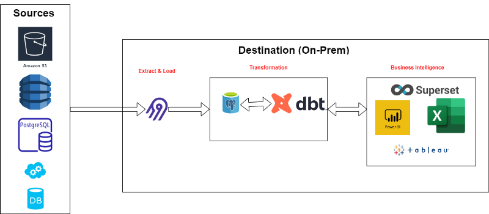

# Introduction

I created this repo to simulate modern data architecture by using the tools below. Also, [I have written about this topic on Medium](https://mebaysan.medium.com/introduction-to-modern-data-architecture-1236272dd5d5).

# [Airbyte](https://airbyte.com/)

- [airbyte](./airbyte/) folder is a submodule of official Airbyte repo. 
- You should get more information by using [docs.airbyte.com](https://docs.airbyte.com/).
- For our repo, we will use just `docker-compose up -d` then Airbyte will be published on `localhost:8000`.
- We use this tool to load the data that is located in [Source](./Source/) folder into the database we will use with our [dbt](./modern_data_architecture/) project.

# [DBT](https://www.getdbt.com/)

- [Source](./Source/) folder is created to provide data for dbt.
- [Modern-Data-Architecture-DBT](./Modern-Data-Architecture-DBT/) folder is the dbt project for the data provided in [Source](./Source/) folder. The data is from Kaggle by [Brazilian E-Commerce Public Dataset by Olist](https://www.kaggle.com/datasets/olistbr/brazilian-ecommerce).

# [Apache Superset](https://superset.apache.org/)

- I have created a sub module in [Superset-Production-Environment](./Superset-Production-Environment/) folder. Also you can visit its original repo by using [here](https://github.com/mebaysan/Superset-Production-Environment). I have created that repo to make easy the set up progress of Superset.
- You have to override the [superset_config.py](./Superset-Production-Environment/superset_config.py) file to run Superset on your local with the [dbt](.Modern-Data-Architecture-DBT/) project.
- Also, you should add more `RUN pip install <package>` in [Dockerfile](./Superset-Production-Environment/Dockerfile) to install database connectors if you want to use other databases.
- Your Superset database credentials *should be* different than [dbt project](./Modern-Data-Architecture-DBT/)'s output database.

# How to utilize this repo?

You can follow the steps below to simulate the tools I mentioned above.

1. Download the data from [Brazilian E-Commerce Public Dataset by Olist](https://www.kaggle.com/datasets/olistbr/brazilian-ecommerce) into your local.
2. Load the downloaded data into the database you wanted by using [Airbyte](./airbyte/) or [script.py](./Source/script.py).
   1. You should use `docker-compose up -d` in [airbyte](./airbyte/) folder to load the data by using Airbyte.
   2. You should override [script.py](./Source/script.py) then execute the script to load the data.
3. Run the dbt transformations by using `dbt run` in [Modern-Data-Architecture-DBT](./Modern-Data-Architecture-DBT/) folder.
4. Also, if you want you can add the [Modern-Data-Architecture-DBT](./Modern-Data-Architecture-DBT/) project's git url into the Airbyte to use your custom transformation in Airbyte. But to use this version, you have to put your dbt configuration file into Airbyte volumes.
5. Run [Superset](./Superset-Production-Environment/) and connect the database you transformed the data by using dbt.
